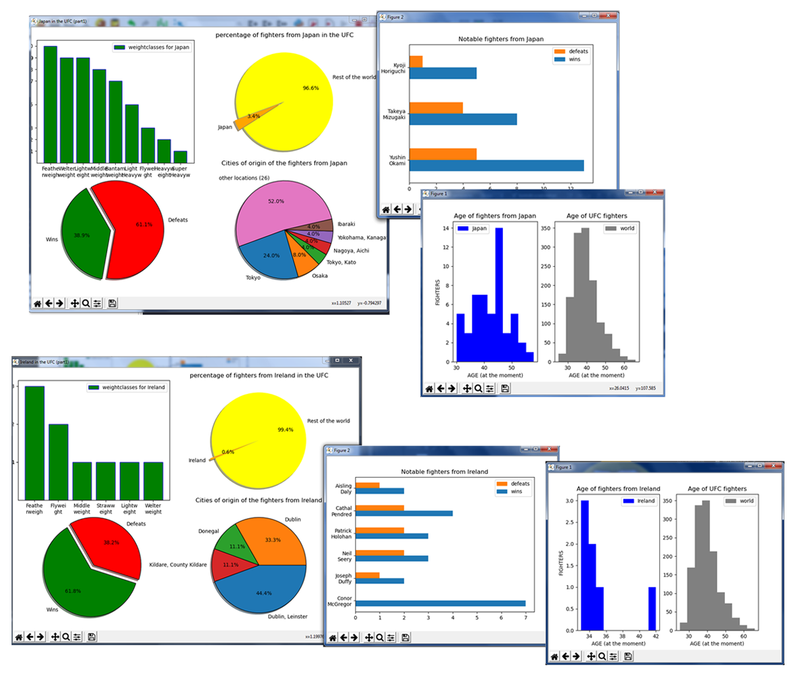

# ChartUFC
## What is it?

This app is analysing the csv file scrapped from www.sherdog.com.
It is showing us basic analitics about UFC in charts.



## Development

For now app is showing data about a countries.

I want to add other querries: 
* comparison between countries
* fighters comparison
* analytics for events
* analytics of a given year in the UFC company

For now data is outdated (2016) as I am using a csv i found somewhere in the deep abbys of the net :)

```diff 
+I am planning to write my own web scraping tool so the app will run updates from the site on its own.
```

## Technology
Software written in Python 3.
It uses panda and Matplotlib


## license & copyright:
©Ludwik R. Papaj
